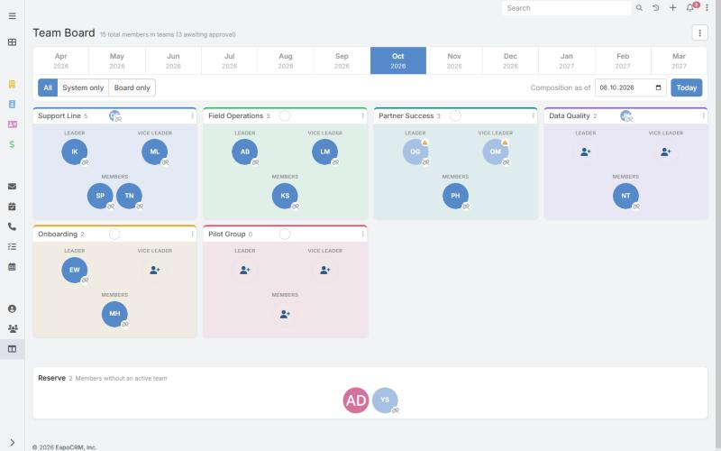
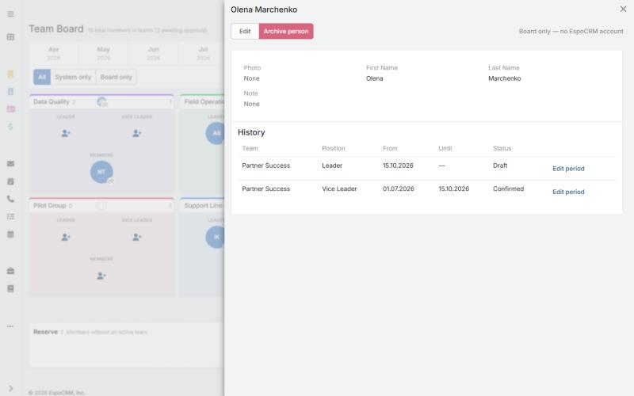

# MC Team Board

**A team board for EspoCRM: see who works in which team on any date — past, today or planned — and plan changes ahead with drag and drop.**

English · [Українська](README.uk.md)

Version **2.0.0** · EspoCRM **10.0.8+** · PHP **8.3+** · AGPL-3.0

## What you can do

- **See any day.** Browse team composition in the past, today or the future with a month strip and a date picker.
- **Plan ahead.** Schedule who joins, leaves or changes position on a future date. Plans start as a *Draft* and take effect once *Confirmed*.
- **Move people by drag and drop** between teams, positions and the reserve.
- **Use your CRM teams and users, or your own.** Create teams and people that exist only on the board, without adding anything to the CRM.
- **Keep the history.** Every person has a timeline of teams, positions and dates.
- **Control access.** Admins, editors and read-only viewers; everyone else is kept out.
- **Work anywhere.** English and Ukrainian interface, follows your EspoCRM theme, works on phones.

## Install

1. Download `team-board-2.0.0.zip` from [Releases](../../releases).
2. In EspoCRM open **Administration → Extensions**, upload the ZIP and click **Install**.
3. Add *Team Board* to the navigation menu (**Administration → User Interface**) and give the roles that need it access (**Administration → Roles**).

Requires EspoCRM 10.0.8 or later, PHP 8.3 or later, and cron configured for EspoCRM.

## More

- [Full feature description](docs/features.md)
- Upgrading from version 1, scheduled jobs, building from source and known limitations are described there.

## License

[GNU AGPL v3](LICENSE).
