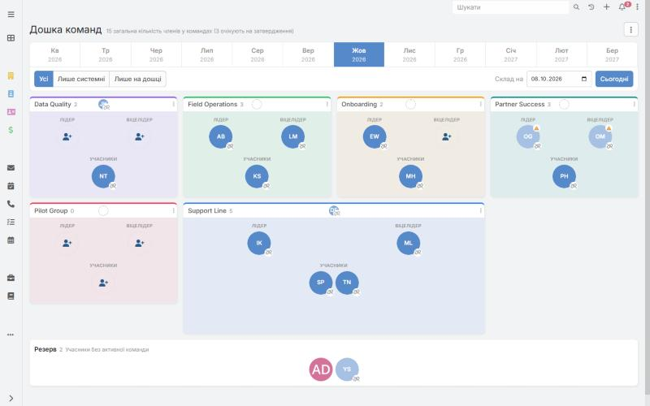
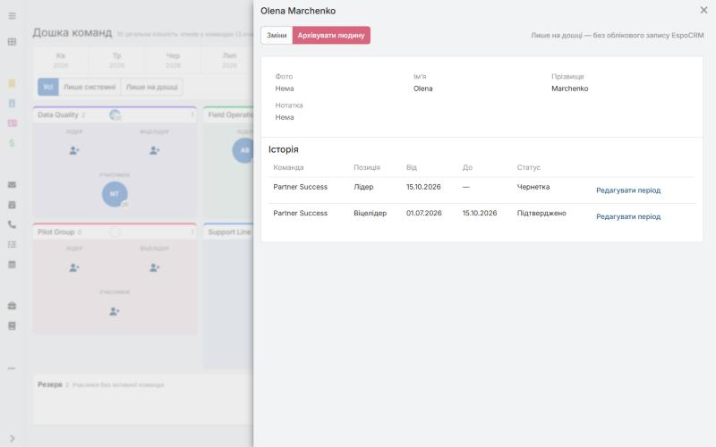
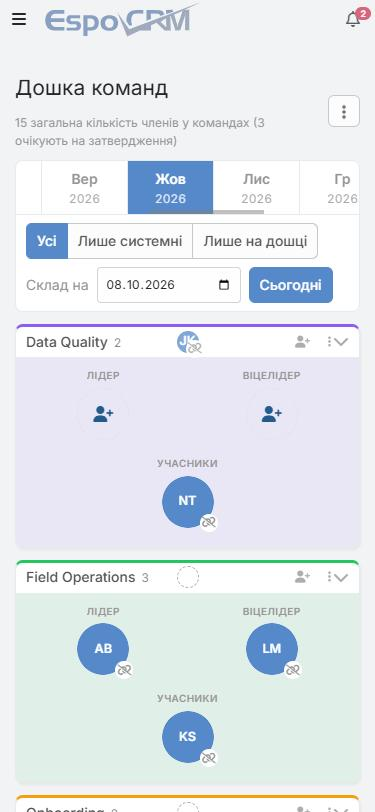

# MC Team Board

**Дошка команд для EspoCRM: бачте, хто в якій команді працює на будь-яку дату — минулу, сьогодні чи майбутню — і плануйте зміни наперед, перетягуючи людей.**

[English](README.md) · Українська

Версія **2.0.0** · EspoCRM **10.0.8+** · PHP **8.3+** · AGPL-3.0

## Що можна робити

- **Дивитися будь-який день.** Переглядайте склад команд у минулому, сьогодні чи в майбутньому за допомогою стрічки місяців і вибору дати.
- **Планувати наперед.** Заплануйте, хто приходить, іде чи змінює позицію на майбутню дату. План починається як *Draft* (чернетка) і набирає чинності після підтвердження (*Confirmed*).
- **Перетягувати людей** між командами, позиціями та резервом.
- **Користуватися командами й користувачами CRM або власними.** Створюйте команди й людей, які існують лише на дошці, без змін у CRM.
- **Зберігати історію.** Для кожної людини є хронологія команд, позицій і дат.
- **Керувати доступом.** Адміністратори, редактори та глядачі лише для перегляду; решта користувачів не мають доступу.
- **Працювати де завгодно.** Інтерфейс українською й англійською, тема EspoCRM успадковується, дошка зручна на телефоні.

## Встановлення

1. Завантажте `team-board-2.0.0.zip` зі сторінки [Releases](../../releases).
2. В EspoCRM відкрийте **Administration → Extensions**, завантажте ZIP і натисніть **Install**.
3. Додайте *Team Board* до меню навігації (**Administration → User Interface**) і надайте доступ ролям, яким це потрібно (**Administration → Roles**).

Потрібні EspoCRM 10.0.8 або новіша, PHP 8.3 або новіший і налаштований cron для EspoCRM.

## Докладніше

- [Повний опис функціоналу](docs/features.uk.md) · [Full feature description](docs/features.md)
- Оновлення з версії 1, заплановані завдання, збірка з коду та відомі обмеження описані там.

## Ліцензія

[GNU AGPL v3](LICENSE).
